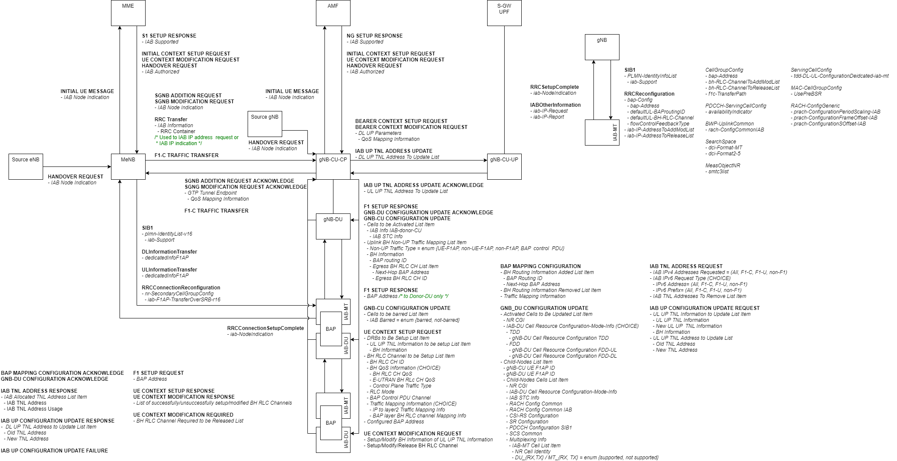

# Integrated Access and Backhaul (IAB)

- [Integrated Access and Backhaul (IAB)](#integrated-access-and-backhaul-iab)
- [Change Requests](#change-requests)
- [Overview](#overview)
- [Behavioral Aspects](#behavioral-aspects)
  - [36.304](#36304)
  - [38.304](#38304)
  - [38.331](#38331)
    - [SRB2 without DRB](#srb2-without-drb)
    - [BL RLF](#bl-rlf)

# Change Requests

| Spec | TDoc | Meeting | Date |
|------|------|---------|------|
| 36.304 | [R2-2002404] | RAN2#109-e | Mar 12, 2020 |
| 36.304 | [R2-2006150] | RAN2#110-e | Jun 15, 2020 |
| 36.331 | [R2-2002358] | RAN2#109-e | Mar 11, 2020 |
| 36.413 | [R3-204404] | RAN3#108-e | Jun 23, 2020 |
| 36.423 | [R3-204519] | RAN3#108-e | Jun 24, 2020 |
| 38.304 | [R2-2002403] | RAN2#109-e | Mar 12, 2020 |
| 38.304 | [R2-2006149] | RAN2#110-e | Jun 15, 2020 |
| 38.306 | [R2-2004979] | RAN2#110-e | May 21, 2020 |
| 38.331 | [R2-2002406] | RAN2#110-e | Jun 25, 2020 |
| 38.331 | [R2-2006429] | RAN2#110-e | Jun 25, 2020 |
| 38.413 | [R3-204405] | RAN3#108-e | Jun 23, 2020 |
| 38.423 | [R3-204402] | RAN3#108-e | Jun 23, 2020 |
| 38.463 | [R3-204403] | RAN3#108-e | Jun 23, 2020 |
| 38.473 | [R3-204464] | RAN3#108-e | Jun 23, 2020 |

[R2-2002403]: http://www.3gpp.org/ftp/TSG_RAN/WG2_RL2/TSGR2_109_e/Docs/R2-2002403.zip
[R2-2002404]: http://www.3gpp.org/ftp/TSG_RAN/WG2_RL2/TSGR2_109_e/Docs/R2-2002404.zip
[R2-2002406]: http://www.3gpp.org/ftp/TSG_RAN/WG2_RL2/TSGR2_109_e/Docs/R2-2002406.zip
[R2-2002358]: http://www.3gpp.org/ftp/TSG_RAN/WG2_RL2/TSGR2_109_e/Docs/R2-2002358.zip
[R2-2004979]: http://www.3gpp.org/ftp/TSG_RAN/WG2_RL2/TSGR2_110-e/Docs/R2-2004979.zip
[R2-2006149]: http://www.3gpp.org/ftp/TSG_RAN/WG2_RL2/TSGR2_110-e/Docs/R2-2006149.zip
[R2-2006150]: http://www.3gpp.org/ftp/TSG_RAN/WG2_RL2/TSGR2_110-e/Docs/R2-2006150.zip
[R2-2006429]: http://www.3gpp.org/ftp/TSG_RAN/WG2_RL2/TSGR2_110-e/Docs/R2-2006429.zip
[R3-204404]: http://www.3gpp.org/ftp/TSG_RAN/WG3_Iu/TSGR3_108-e/Docs/R3-204404.zip
[R3-204519]: http://www.3gpp.org/ftp/TSG_RAN/WG3_Iu/TSGR3_108-e/Docs/R3-204519.zip
[R3-204405]: http://www.3gpp.org/ftp/TSG_RAN/WG3_Iu/TSGR3_108-e/Docs/R3-204405.zip
[R3-204402]: http://www.3gpp.org/ftp/TSG_RAN/WG3_Iu/TSGR3_108-e/Docs/R3-204402.zip
[R3-204403]: http://www.3gpp.org/ftp/TSG_RAN/WG3_Iu/TSGR3_108-e/Docs/R3-204403.zip
[R3-204464]: http://www.3gpp.org/ftp/TSG_RAN/WG3_Iu/TSGR3_108-e/Docs/R3-204464.zip

# Overview

# Behavioral Aspects

## 36.304

- IAB-MT does not apply the access control
- IAB-MT ignores *cellBarred, cellReservedForOperatorUse, cellReservedForOtherUse, intraFreqReselection*
(i.e. treats *intraFreqReselection* as if it was set to *allowed*)
- IAB-MT considers a cell is barred if *iab-Support* for a PLMN

## 38.304

- IAB-MT does not apply the unified access control
- IAB-MT ignores *cellBarred, cellReservedForOperatorUse, cellReservedForOtherUse, intraFreqReselection*
(i.e. treats *intraFreqReselection* as if it was set to *allowed*)
- IAB-MT considers a cell is barred if *iab-Support* for a PLMN

## 38.331

### SRB2 without DRB

SRB2 without DRB is supported for IAB-MT, which affects to:
- RRC Reconfiguration
- RRC Reestablishment
- RRC Release
- Radio Link Failure
- MCG Failure
- Mobility from NR

### BL RLF

BH RLF indication on BAP entity triggers MCG/SCG RLF
